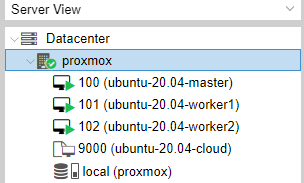

## Install Proxmox VE

The first step is to install [Proxmox VE](https://www.proxmox.com/en/downloads/category/iso-images-pve) on a bare-metal machine. The Proxmox VE ISO image is available [here](https://www.proxmox.com/en/downloads/category/iso-images-pve). 

However, the ISO image only supports installation using the entire disk. Thus, we first install Debian 11 (bullseye) and then install Proxmox as a software on Debian. In this way, we can customize the partition rather than use the entire disk.

### 1. Ventoy

We use [Ventoy](https://www.ventoy.net/en/download.html), a new Bootable USB Solution, to boot the Debian ISO image (or Proxmox VE). Using Ventoy, we can boot multiple ISO images without formatting the USB disk.

Ventoy supports both x86 Legacy BIOS and UEFI Secure Boot.

### 2. Proxmox

After installing Debian 11, we follow official instructions [here](https://pve.proxmox.com/wiki/Install_Proxmox_VE_on_Debian_11_Bullseye) to install Proxmox VE.

#### 2.1 Create a bridge network

The bridge network interface allows VMs inside Proxmox to get IP from the router using DHCP.


#### 2.2 Ubuntu Cloud Image

We create the k3s cluster using Ubuntu VMs cloned from a template. The template can be created with Ubuntu Cloud Image.

```
# Log into Proxmox

# Create Ubuntu Cloud Image
$ curl -O http://cloud-images.ubuntu.com/releases/focal/release/ubuntu-20.04-server-cloudimg-amd64.img
$ sudo apt install libguestfs-tools -y
$ sudo virt-customize -a ubuntu-20.04-server-cloudimg-amd64.img --install qemu-guest-agent --truncate /etc/machine-id 

# Create a template VM
$ sudo qm create 9000 \
         --name ubuntu-20.04-cloud-init --numa 0 --ostype l26 \
         --cpu cputype=host --cores 1 --sockets 1 \
         --memory 1024  \
         --net0 virtio,bridge=vmbr0

# Replace local with your local storage (e.g. local-lvm)
$ sudo qm importdisk 9000 ubuntu-20.04-server-cloudimg-amd64.img local  -format qcow2
$ sudo qm set 9000 --scsihw virtio-scsi-pci --scsi0 /var/lib/vz/images/9000/vm-9000-disk-0.qcow2
$ sudo qm resize 9000 scsi0 +6G
$ sudo qm set 9000 --ide2 local:cloudinit
$ sudo qm set 9000 --boot c --bootdisk scsi0
$ sudo qm set 9000 --serial0 socket --vga serial0
$ sudo qm set 9000 --agent enabled=1
```

Then, you can set up cloud init from web interface (e.g. ssh public key):


Lastly, create the template.

```
$ qm template 9000
```

We can create three Ubuntu VMs from the template:

```
$ qm clone 9000 110 --name Ubuntu-20.04-manager --full
$ qm clone 9000 111 --name Ubuntu-20.04-compute-01 --full
$ qm clone 9000 112 --name Ubuntu-20.04-compute-02 --full
```



Remember to change the hostname for each Ubuntu VM because the slurm scheduler won't accept nodes with duplicated hostnames.

```
$ ssh ubuntu@192.168.1.219
$ sudo hostnamectl set-hostname manager

$ ssh ubuntu@192.168.1.181
$ sudo hostnamectl set-hostname compute01

$ ssh ubuntu@192.168.1.152
$ sudo hostnamectl set-hostname compute02
```

Now, we are ready to create a HPC cluster.
