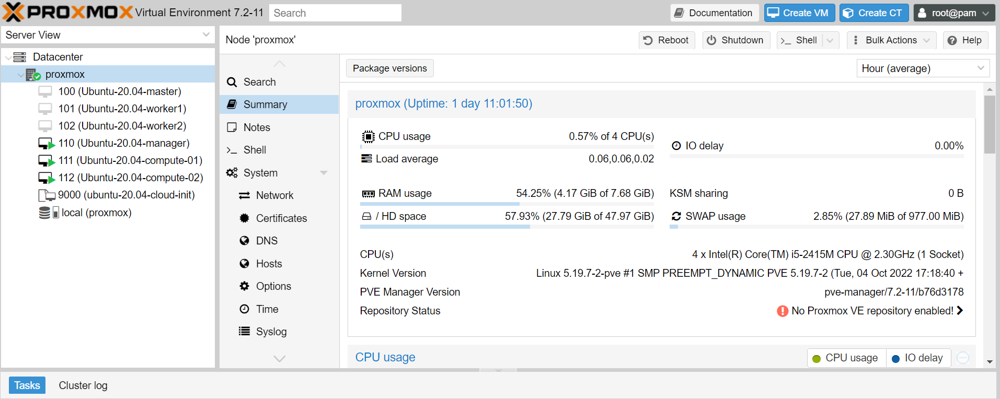

## A HPC Cluster (Slurm) on Proxmox VMs

> A local HPC cluster that uses the Slurm Scheduler.

- [Step 1: Install Proxmox](1-proxmox-cloud-init/README.md).
- [Step 2: Set up K3s Cluster](2-slurm-scheduler/README.md).
- [Step 3: Install Application (Module, MPI)](3-software-management/README.md).

### Requirements

- A Router.
- A baremetal machine such as Intel NUC PC. We used a Mac-mini with 4CPUs and 8GB memory.

### Proxmox VE

Proxmox VE is an open-source server management platform for enterprise virtualization. We created three Ubuntu virtual machines (Cloud Init) to set up a HPC cluster.



### HPC Cluster

The local HPC cluster uses the Slurm Scheduler and Module for management.

```
ubuntu@manager:~$ sinfo
PARTITION AVAIL  TIMELIMIT  NODES  STATE NODELIST
mac*         up   infinite      2   idle compute[01-02]

ubuntu@manager:~$ squeue
             JOBID PARTITION     NAME     USER ST       TIME  NODES NODELIST(REASON)
                36       mac hello-wo   ubuntu  R       0:02      1 compute01

ubuntu@manager:~$ sacct -j 36
       JobID    JobName  Partition    Account  AllocCPUS      State ExitCode
------------ ---------- ---------- ---------- ---------- ---------- --------
36           hello-wor+        mac research_+          1    RUNNING      0:0
36.batch          batch            research_+          1    RUNNING      0:0
```
